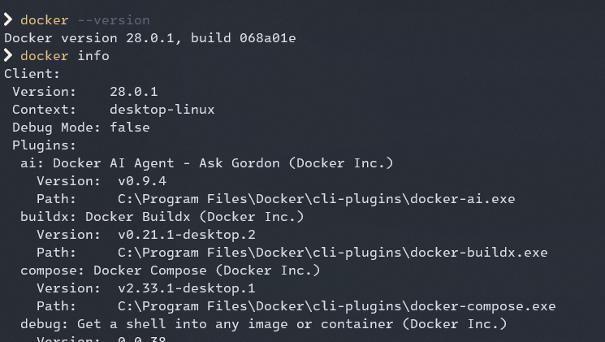

# Introduction to containerization and Docker fundamentals, Basic Commands

## What is Containerization?

Containerization is a lightweight, portable, and self-sufficient method of packaging, deploying, and running applications. It bundles an application along with all its dependencies (libraries, frameworks, configurations, etc.) into a single, isolated unit called a **container**.

**Key Benefits:**

* **Portability:** Containers can run consistently across different environments (developer's laptop, testing server, production cloud).
* **Isolation:** Applications inside containers are isolated from each other and from the host system, preventing conflicts.
* **Efficiency:** Containers are lightweight and start up quickly, utilizing system resources more efficiently than virtual machines.
* **Scalability:** Easy to scale applications up or down by launching or stopping containers.
* **Reproducibility:** Ensures that the application runs the same way everywhere, from development to production.

## What is Docker?

Docker is the most popular platform for building, sharing, and running containerized applications. It provides the tools and a platform to create, deploy, and manage containers.

**Key Concepts in Docker:**

* **Dockerfile:** A text file that contains a set of instructions for building a Docker image.
* **Image:** A lightweight, stand-alone, executable package that includes everything needed to run a piece of software, including the code, a runtime, system tools, system libraries, and settings. Images are read-only templates.
* **Container:** A runnable instance of a Docker image. When you run an image, it becomes a container. Containers are isolated processes running on the host OS.
* **Docker Hub:** A cloud-based registry service provided by Docker for finding and sharing container images. It's like GitHub for Docker images.
* **Docker Engine:** The core component of Docker, which creates and runs Docker containers. It consists of a server (daemon), a REST API, and a command-line interface (CLI).


## Basic Docker Commands

These are some fundamental Docker commands to get you started.

### 1. Docker Version and Info

* **Check Docker version:**
    ```bash
    docker --version
    ```
* **Display system-wide information:**
    ```bash
    docker info
    ```
  
  

### 2. Managing Images

* **Pull an image from Docker Hub:**
    ```bash
    docker pull <image_name>:<tag>
    # Example: docker pull ubuntu:latest
    # Example: docker pull nginx
    ```
* **List all local Docker images:**
    ```bash
    docker images
    ```
* **Remove an image:**
    ```bash
    docker rmi <image_id_or_name>
    # Example: docker rmi ubuntu:latest
    # Example: docker rmi a1b2c3d4e5f6 (replace with actual image ID)
    ```
    * *Note: You might need to remove containers based on the image first (`docker rm`) if it's in use.*

### 3. Managing Containers

* **Run a container (create and start):**
    ```bash
    docker run [OPTIONS] <image_name> [COMMAND] [ARG...]
    # Run a simple Ubuntu container and execute a command
    docker run ubuntu echo "Hello from Docker!"

    # Run an Nginx web server in detached mode (-d) and map port 80 to 8080 (-p)
    docker run -d -p 8080:80 nginx

    # Run a container interactively (-it)
    docker run -it ubuntu bash
    ```
    * `-d`: Run container in detached mode (in the background).
    * `-p <host_port>:<container_port>`: Publish a container's port(s) to the host.
    * `-it`: Allocate a pseudo-TTY and keep STDIN open (interactive mode).
    * `--name <container_name>`: Assign a name to the container.

* **List running containers:**
    ```bash
    docker ps
    ```
* **List all containers (running and stopped):**
    ```bash
    docker ps -a
    ```
* **Start a stopped container:**
    ```bash
    docker start <container_id_or_name>
    # Example: docker start my_nginx_server
    ```
* **Stop a running container:**
    ```bash
    docker stop <container_id_or_name>
    # Example: docker stop my_nginx_server
    ```
* **Restart a container:**
    ```bash
    docker restart <container_id_or_name>
    ```
* **Remove a stopped container:**
    ```bash
    docker rm <container_id_or_name>
    # Example: docker rm peaceful_hoover
    ```
    * *Note: You cannot remove a running container unless you use the `-f` (force) flag, which is generally not recommended without stopping it first.*
    ```bash
    docker rm -f <container_id_or_name> # Use with caution
    ```
* **Execute a command inside a running container:**
    ```bash
    docker exec -it <container_id_or_name> <command>
    # Example: docker exec -it my_nginx_server bash
    # Example: docker exec my_nginx_server ls -l /var/www/html
    ```
* **View logs of a container:**
    ```bash
    docker logs <container_id_or_name>
    # To follow logs in real-time:
    docker logs -f <container_id_or_name>
    ```

### 4. Cleaning Up

* **Remove all stopped containers:**
    ```bash
    docker container prune
    ```
* **Remove all unused images (dangling images - not associated with any container and not tagged):**
    ```bash
    docker image prune
    ```
* **Remove all unused images (including those not dangling):**
    ```bash
    docker image prune -a
    ```
* **Remove all unused Docker objects (containers, images, networks, volumes):**
    ```bash
    docker system prune
    # To remove everything including volumes (use with extreme caution as this deletes data):
    docker system prune -a --volumes
    ```
